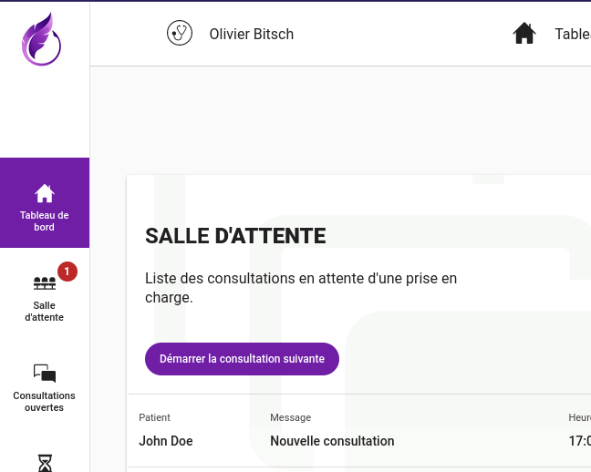
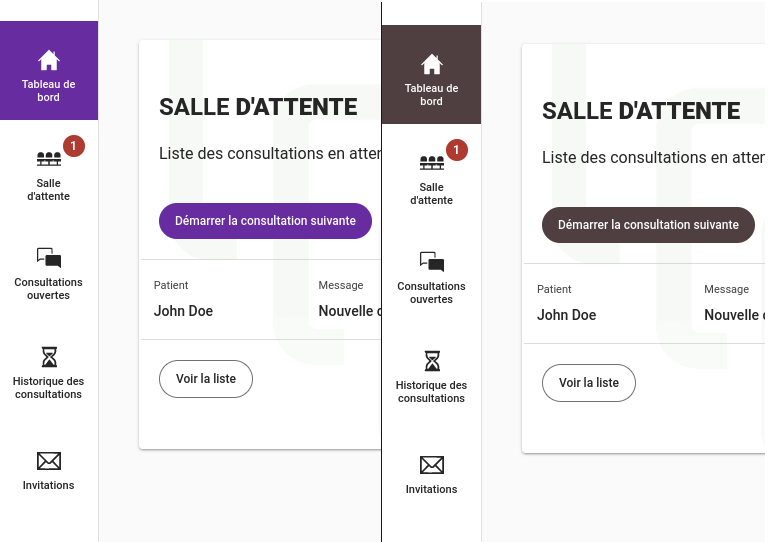

# How to customize HCW@Home

Since version 5.0, it's possible to customize the interface of HCW@Home.

The following components can be customized:

- The logo: 
    - displayed on the home page and login page of patient interface.
    - displayed on the doctor application.
- The primary color:
    - display in various location of both patient and doctor interface. The primary color can be chosen for each interface.
- The Home page message:
    - Visible on the left pane of the patient page screen.
- The Login page message:
    - Visible on the left pane of the consultation requester login page.
- The terms and conditions:
    - Visible on consultation requester account register page.
-     Visible on the patient home page.


## Configure the logo

The logo must be a browser compatible image (png, svg, jpg, ...) and is simply configured into backend.

```
LOGO=<url>
```

The URL can be relative (e.g if you upload in a folder of the doctor or patient app), or absolute (the logo is hosted somewhere else).

By example with Debian package, you can put into /etc/hcw-athome/hcw-athome.conf.

```
LOGO=/assets/logo.png
```

Then place the logo into the following folder:

- patient: /usr/share/hcw-athome/patient/assets/logo.png
- doctor: /usr/share/hcw-athome/caregiver/assets/logo.png

> Note 1 : You can have different logo this way. If you put the full URL, the same logo will be used for doctor and patient interface.
> Note 2 : The admin interface doesn't have any possible customization yet.




## Configure the primary color

The primary color change the accent color into patient and doctor interface. Patient and doctor interfaces can have different color if required.

The color is configured in the backend:

```
DOCTOR_APP_PRIMARY_COLOR=#523C3D
PATIENT_APP_PRIMARY_COLOR=#523C3D
```

The color of the app.



## Change the branding name

Branding ensures that patient is using the right instance and also limit the risk of scamming. This branding is used into SMS and patient application.

```
BRANDING=HCW@Home
```

Here a sample how mail is changed with this branding.

